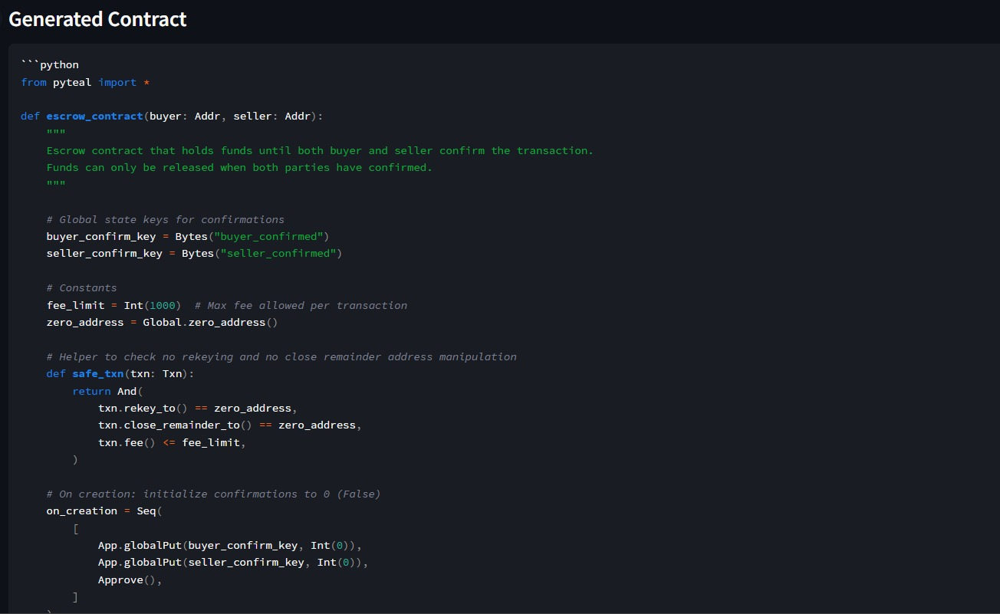
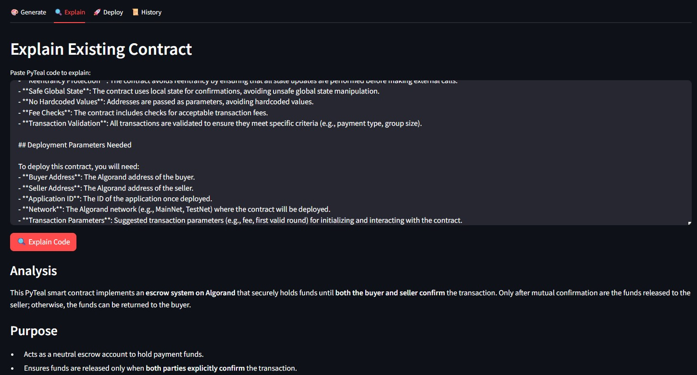
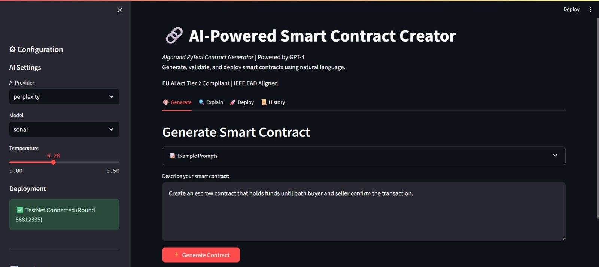

# 🔗 AI-Powered Algorand Smart Contract Creator

Production-grade platform for generating, validating, and deploying Algorand PyTeal smart contracts using natural language and AI (Perplexity/GPT-4).

## 🎯 Features

- **Natural Language → PyTeal**: Describe contracts in plain English
- **Multi-Layer Validation**: Syntax, security, and compilation checks
- **Auto-Correction**: Self-healing generation with retry logic
- **TestNet Deployment**: One-click deployment to Algorand TestNet
- **Audit Trail**: Complete logging of all generations
- **Explainability**: AI-powered code explanations
- **Security-First**: OWASP-aligned, EU AI Act Tier 2 compliant
- **AlgoKit Integration**: Compatible with AlgoKit tooling

## 📁 Project Structure

```
algorand-ai-contract-creator/
├── src/
│   └── algorand_ai_contractor/       # Main package
│       ├── core/                     # Core business logic
│       │   ├── ai_engine.py          # AI contract generator
│       │   └── algorand_utils.py     # Blockchain utilities
│       ├── contracts/                # Contract templates & config
│       │   ├── config.py             # Contract schemas
│       │   └── templates/            # Reusable templates
│       └── ui/                       # User interfaces
│           └── streamlit_app.py      # Streamlit web app
├── tests/                            # Test suite
│   └── test_contracts.py
├── scripts/                          # Utility scripts
│   ├── install.sh                    # Unix install script
│   ├── install.bat                   # Windows install script
│   ├── run.sh                        # Unix run script
│   └── run.bat                       # Windows run script
├── outputs/                          # Generated artifacts (gitignored)
│   ├── contracts/                    # AI-generated contracts
│   ├── teal/                         # Compiled TEAL files
│   └── logs/                         # Generation logs
├── docs/                             # Documentation
├── .streamlit/                       # Streamlit config
│   └── config.toml
├── .env.example                      # Environment template
├── .gitignore                        # Git ignore rules
├── pyproject.toml                    # Python project config
├── requirements.txt                  # Production dependencies
├── requirements-dev.txt              # Development dependencies
├── README.md                         # This file
├── CONTRIBUTING.md                   # Contribution guidelines
├── CHANGELOG.md                      # Version history
└── .algokit.toml                     # AlgoKit configuration
└── .env.example                      # Add here your API's
└── .gitignore                        # Make sure to add anything else you don't want to show your mum
└── #ai_generations.log               # Logs that gets created after you run the app
└── algorand_ai_contract_creator.code-workspace # Your workspace info
└── CHANGELOG.md                      # What you have to update with your updates when you update
└── CONTRIBUTING.md                   # Instructions, in case you new you can also reach out
└── LICENSE                           # Off the market... Sorry
└── main.py                           # You would be a criminal if you didn't have one
└── pyproject.toml                    # Pyproject record, touch if you know where
└── README.md                         # You are reading it, well done!
└── requirements-dev.txt              # Install these after installing the following
└── requirements.txt                  # Well, above is a 'rule of thumb'
```


## 🚀 Quick Start

### Prerequisites

- Python 3.10+
- Perplexity API key OR OpenAI API key
- Algorand TestNet account (for deployment)

### Installation

**Windows (Easy Mode):**

```bash
# Run the installation script
scripts\install.bat

# Follow the prompts
```

**Manual Installation:**

```bash
$ git clone <repository-url>
$ cd algorand-ai-contract-creator
$ python -m venv venv
$ venv\Scripts\activate  # On Windows
$ source venv/bin/activate  # On macOS/Linux

# Install package in editable mode
$ pip install -e .

# Install dependencies
$ pip install -r requirements.txt
```

### Configuration

1. **Copy environment template:**

   ```bash
   copy .env.example .env  # Windows
   cp .env.example .env    # macOS/Linux
   ```

2. **Add your API key to `.env`:**

   ```bash
   AI_PROVIDER=perplexity
   PERPLEXITY_API_KEY=pplx-your-actual-key-here
   ```

3. **Get API key from:** https://www.perplexity.ai/settings/api

### Run Application

**Windows:**

```bash
scripts\run.bat
```

**Unix/macOS/Linux:**

```bash
./scripts/run.sh
```

**Manual:**

```bash
# Activate virtual environment
source venv/bin/activate  # On Unix/macOS
venv\Scripts\activate     # On Windows

# Run Streamlit app
streamlit run src/algorand_ai_contractor/ui/streamlit_app.py

# Run Streamlit
streamlit run tools\web_interface.py
```

Navigate to `http://localhost:8501`

## 📖 Usage

### 1. Generate Contract

- Enter natural language description
- Click "Generate Contract"
- Review code, explanation, and audit summary
- Download or deploy to TestNet

### 2. Deploy to TestNet

- Compile generated contract to TEAL
- Fund a TestNet account via [dispenser](https://testnet.algoexplorer.io/dispenser)
- Deploy with your private key
- View on AlgoExplorer

### 3. Explain Existing Code

- Paste PyTeal code
- Get human-readable explanation

## 🧪 Testing

```bash
# Run all tests
$ pytest tests/ -v

# Or using AlgoKit
$ algokit project run test
```

## 🔒 Security

- Temperature capped at 0.2 for deterministic output
- Automatic detection of dangerous patterns (`eval()`, `exec()`)
- No hardcoded keys in generated contracts
- All deployments logged for audit trail
- Private keys never stored
- Multi-layer validation pipeline

## 🤖 AI Providers

### Perplexity (Recommended)

- **Models**: `llama-3.1-sonar-small-128k-online`, `llama-3.1-sonar-large-128k-online`
- **Pros**: More affordable, online search capability, good for latest docs
- **Get Key**: https://www.perplexity.ai/settings/api

### OpenAI

- **Models**: `gpt-4`, `gpt-4-turbo`
- **Pros**: Industry standard, highly reliable
- **Get Key**: https://platform.openai.com/api-keys

## 📊 Performance Metrics

- **Compilation Success Rate**: TBC
- **Average Generation Time**: TBC
- **Retry Rate**: TBC
- **Security Compliance**: EU AI Act Tier 2, IEEE EAD

## 🛠️ Architecture

```
User Input (Natural Language)
        ↓
AI Engine (Perplexity/GPT-4 with safety prompts)
        ↓
Validation Pipeline (Syntax + Security)
        ↓
PyTeal → TEAL Compilation
        ↓
Algorand TestNet Deployment
        ↓
AlgoExplorer Integration
```

## 📝 Example Prompts

**Escrow Contract:**

> "Create an escrow that holds 10 ALGO until both buyer and seller call approve()"

**Time-Lock Vault:**

> "Design a vault that releases funds to address X after Unix timestamp Y"

**Voting System:**

> "Build a voting contract where each address can vote once on a yes/no proposal"

**Multi-Sig Wallet:**

> "Create a 2-of-3 multi-signature wallet for secure fund management"

## 🤝 Contributing

1. Fork repository
2. Create feature branch (`git checkout -b feature/amazing-feature`)
3. Add tests for new features
4. Run tests (`pytest tests/ -v`)
5. Commit changes (`git commit -m 'Add amazing feature'`)
6. Push to branch (`git push origin feature/amazing-feature`)
7. Submit Pull Request

## 📜 License

MIT License - See LICENSE file

## 🆘 Support

- **Issues**: GitHub Issues
- **Documentation**: `/docs` folder
- **Algorand SDK**: https://developer.algorand.org
- **PyTeal Docs**: https://pyteal.readthedocs.io
- **AlgoKit**: https://github.com/algorandfoundation/algokit-cli

## 🔗 Resources

- [AlgoKit Documentation](https://github.com/algorandfoundation/algokit-cli)
- [Perplexity API Docs](https://docs.perplexity.ai/)
- [OpenAI API Docs](https://platform.openai.com/docs)
- [PyTeal Examples](https://github.com/algorand/pyteal/tree/master/examples)


## 🖼️ Screenshots

Thanks — I've renamed your images to friendly filenames and updated the examples below so they display correctly in the README.

- images/dashboard-1.jpeg
- images/dashboard-2.jpeg
- images/dashboard-3.jpeg

Inline display (HTML):







Copyable Markdown (clean names):

```markdown


```

Side-by-side thumbnails (HTML):

<div>
        
        
        
</div>

If you'd like different names or a different layout, tell me and I can change them.


**⚠️ DISCLAIMER**: This tool generates smart contracts for educational and testing purposes. Always conduct thorough security audits before deploying to MainNet. AI-generated code should be reviewed by experienced developers.

